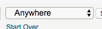

<style>
img { max-width:400px; height: auto;}
img,iframe {border: 1px solid #ccc;}
a { color: blue; }
pre code { font: 9px; }
pre { font: inherit; word-wrap: break-word; background: none; border: none; }
.force-thumbnail { width: 150px; }
.force-thumbnail img { height: auto; }
</style>

# Search.library.duke.edu Assessment

__<https://search.library.duke.edu/search?Ntt=cats&Ntk=Keyword&sugg=&local-filter=TRUE&affiliation=Duke>__

__Screenshot:__


# Accessibility

To use Duke's resources efficiently and accomplish the goal of retrofitting some accessibility fixes in a timely manner, this review is limited to issues that will make it possible for a screen reader user to use the advanced search. It does not make it super easy to use, but it does make it possible to use. It does not cover issues like color contrast which would not benefit a screen reader only user.

This assessment is on a website that was made many years ago, its is not fair to compare it to an accessibility standard that did not exist when it was created. Assessments are in no way a commentary on how a website was created or its code. It is simply a collection of improvements and recipes to improve its functionality and compliance with current standards.

This report was put together with haste in one day. These normally take 20 or 30 hours.  Please excuse any spelling or grammar errors ;-) 

<br>


## Add full list of current filters to the `<title>` tag

This webpage does a full refresh when a search term or filter is changed. Currently it is not clear if a term has been successfully added or filtered.  When a page loads on a screen reader the page title is announced to them.  We can use this behavior to indicate that the requested search function was successfully applied.

For this search:
<https://search.library.duke.edu/search?Ntk=Keyword&Nr=OR%28210969%2cOR%28206474%29%29&Ne=2+206474+210899+210956+200043&N=4294967271+206437&Ntt=cats>

The resulting title is:

```html
<title>Duke Libraries Catalog: cats</title>
```

#### Suggested solution:

For the search indicated above add its current filter set:

```html
<title>Duke Libraries Catalog: cats - Filtered by - Subject: history - Format: book</title>
```

__Please listen to simulation of result__

<audio controls>
  <source src="assets/audio--title.mp3" type="audio/mpeg">
Your browser does not support the audio element.
</audio>

Add all terms to the title. When the page refreshes the entire title will be read to the screen reader user. Adding the term will:

1. Describe the contents on the new page.
2. Indicate that the filter was successfully applied.

<br>

<hr>

<br>


## Add headings to improve navigation of content on the webpage

The use of headings allows screen readers to interpret structure of the webpage so they can navigate easier [Learn more](https://developers.google.com/web/fundamentals/accessibility/how-to-review#take_advantage_of_headings_and_landmarks).

### Add `<h1>` that indicates the content on the webpage.
It is an expected practice to have a heading above the search results to indicate what is being shown on the webpage. for screen reader users.

To avoid the need to write css we will hide the heading from sighted users.  It will be read to a screen reader, but not be visible to sighted users.

```html
<h1 class="element-invisible">Cats - Filtered by - Subject: history - Format: book</h1>
```

CSS class necessary to hide from sighted users:

```css
.element-invisible {
  margin: 0;
  padding: 0;
  width: 1px;
  position: absolute !important;
  clip: rect(1px,1px,1px,1px);
  overflow: hidden;
  height: 1px;
}
```

<br>

<hr>

<br>

### Add headings to add structure to the facet column

Screen readers can navigate using headers. ARIA to the rescue again. By using ARIA `role="heading"` and `aria-level=""` we can add this information without the need for CSS.


#### Suggested solution:

Paste in two sets of ARIA attributes.

```html
<div id="facets">
    <table width="100%" class="noBorder" id="currentSearch">
        <tbody>
            <tr>
                <td class="shadedBox" align="center">
~                    <span class="label" role="heading" aria-level="2">Current Search</span>
                    ...
                </td>
            </tr>
            ...
        </tbody>
    </table>
    <br>
    <table width="100%" class="noBorder" id="facetBar">
        <tbody>
            <tr>
                <td class="shadedBox" align="center">
~                    <span class="label" role="heading" aria-level="2">Refine Your Search</span>
                </td>
            </tr>
            ...
    <table id="lcClassificationDimensionBlock" width="100%">...</table>
</div>
```

__[Please view Gist](https://gist.github.com/jhc36-duke-edu/4a296aa367544ebac2d304b47ada4782/revisions)__

Ideally, the items nested below the H2's like "Subject", "Medical Subject", "Format", etc would be added as faux H3, but there are higher priority items.

<br>

<hr>

<br>

## ARIA landmark elements need added to enable screen reader to skip to specific areas of the webpage

Landmark elements are used to improve the keyboard navigation of the page for assistive technology. [Learn more](https://developers.google.com/web/fundamentals/accessibility/how-to-review#take_advantage_of_headings_and_landmarks).


### Tables are being used for layout instead of tabular data

While tables are primarily intended for the presentation of tabular information or data. In the past they were commonly used to control page layout and formatting. Layout tables can introduce difficulties to screen readers.

It would be too invasive to rewrite the visual layout of the page to use `<div>`s. Multiple nested tables makes navigating the webpage difficult at best. But, it is not practical to fix on our timeline. 

We can mitigate the issue by retrofitting ARIA Landmarks to assist screen readers in navigating the page efficiently. This is relatively non-invasive cut-paste type win with a big positive impact.

#### Suggested solution:

ARIA attributes to the rescue!

First, the current DOCTYPE is set to the XHTML transitional dtd.  

```html
<!DOCTYPE html PUBLIC "-//W3C//DTD XHTML 1.0 Transitional//EN" 
  "http://www.w3.org/TR/xhtml1/DTD/xhtml1-transitional.dtd">

```

To use ARIA attributes we should change it to XHTML+ARIA dtd (this is very safe and won't cause issues elsewhere):

```html
<!DOCTYPE html PUBLIC "-//W3C//DTD XHTML+ARIA 1.0//EN"
  "http://www.w3.org/WAI/ARIA/schemata/xhtml-aria-1.dtd">
```

Next, we can leave the layout as-is. We just need to paste a few ARIA attributes.

```html
    <table border="0" align="center" id="mainContent" cellpadding="0">
        <tr>
~            <td colspan="2" role="banner">
                 ...
~                <table width="100%" border="0" id="searchBar" class="catalogSearchBarCell shadedFacet box" role="search" aria-label="primary search input">...</table>
            </td>
        </tr>
        <tr>
            <td id="facetsColumn">
                <div id="facets">
~                    <table width="100%" class="noBoarder" id="currentSearch" aria-label="current selected criteria" role="search">...</table>
                    <br>
~                    <table width="100%" class="noBoarder" id="facetBar" aria-label="refine selected criteria" role="search">...</table>
                    <br>
                    <table id="lcClassificationDimensionBlock" width="100%">...</table>
                </div>
            </td>
~            <td id="resultsColumn" aria-label="search results" role="main">...</td>
        </tr>
        <tr>
~            <td colspan="2" role="contentinfo">
                <div id="madlib-footer">...</div>
            </td>
        </tr>
    </table>
```

__[Please view Gist](https://gist.github.com/jhc36-duke-edu/a1651327a7ef48e6000dacd06df8bbc5/revisions)__

<br>

<hr>

<br>


## Some form elements do not have associated labels

Labels ensure that form controls are announced properly by assistive technologies, like screen readers. [Learn more](https://dequeuniversity.com/rules/axe/2.2/label?application=lighthouse).

### The search input element is not associated with a label

__Visual location:__


__HTML location:__

```html
<td>		
  <label for="query"></label>
  <input type="text" size="40" name="query" id="Ntt" class="catalogSearchFormElement ac_input" value="cats" autocomplete="off">
</td>
```

#### Suggested solution:

The `<label>` already exists but does not associate itself to the input. Modern browsers associate the `for` attribute to the `id`, not the `name`. 

To fix just change the label's `for` attribute value from `for="query"` to `for="Ntt"`. 

<details>
<summary>_Additional debugging details_</summary>
Selector:<br>
<code>1,HTML,1,BODY,1,TABLE,0,TBODY,0,TR,0,TD,6,TABLE,0,TBODY,1,TR,0,TD,1,TABLE,0,TBODY,0,TR,0,TD,1,TABLE,6,TBODY,0,TR,1,TD,1,SELECT</code>

Path:<br>
`#Ntk`

More detailed explanation:<br>
Fix any of the following:
<br>aria-label attribute does not exist or is empty
<br>aria-labelledby attribute does not exist, references elements that do not exist or references elements that are empty or not visible
<br>Form element does not have an implicit (wrapped) &lt;label&gt;
<br>Form element does not have an explicit &lt;label&gt;
<br>Element has no title attribute or the title attribute is empty
</details>

<br>

<hr>

<br>


### The select type element is not associated with a label

__Visual location:__



__HTML location:__

```html
<td class="nowrap">
  <label for="searchType">
    
  </label>
  <select name="searchType" id="Ntk" class="catalogSearchFormElement">
    <option value="Keyword">Search for words:</option>
	...
  </select>
  <input type="submit" id="querySubmit" class="catalogSearchBarFormElement" value="Search">
</td>
```

#### Suggested solution:

The `<label>` already exists but does not associate itself to the input. Modern browsers associate the `for` attribute to the `id`, not the `name`.  

To fix just change the label's `for` attribute value from `for="searchType"` to `for="Ntk"`.  

<details>
<summary>_Additional debugging details_</summary>
Selector:<br>
<code>1,HTML,1,BODY,1,TABLE,0,TBODY,0,TR,0,TD,6,TABLE,0,TBODY,1,TR,0,TD,1,TABLE,0,TBODY,0,TR,0,TD,1,TABLE,6,TBODY,0,TR,0,TD,1,INPUT</code>

Path:<br>
`#Ntt`

More detailed explanation:<br>
Fix any of the following:
<br>aria-label attribute does not exist or is empty
<br>aria-labelledby attribute does not exist, references elements that do not exist or references elements that are empty or not visible
<br>Form element does not have an implicit (wrapped) &lt;label&gt;
<br>Form element does not have an explicit &lt;label&gt;
<br>Element has no title attribute or the title attribute is empty
</details>

<br>

<hr>

<br>


## Some image elements do not have `[alt]` attributes

Informative elements should aim for short, descriptive alternate text. Decorative elements can be ignored with an empty alt attribute. [Learn more](https://dequeuniversity.com/rules/axe/2.2/image-alt?application=lighthouse).


### Refine search expanding arrows (multiple)

Currently a screen reader would read the name of the image a couple dozen times since there is not alt tag "DUKE_rightarrow.gif".  Fixing the missing `alt` is a big win. It will make the image more descriptive.


__Example:__


__Visual location:__

Images of arrow with missing `alt` attribute:


__HTML location:__

```html
<a ... >
  
  <strong>Subject</strong>
</a>
```


#### Suggested solution:

Add an `alt` attribute with an accurate description to the image or add invisible screen reader text.

Since both the image and the facet text are in the same link `<a>`, adding `alt="Expanded facet"` it would result in the the screen reader reading _"Expanded facet Subject"_, which both removes the error and is very descriptive.

```html
<a ... >
~  
  <strong>Subject</strong>
</a>
``` 


__[Please view Gist]()__

NOTE: when it is not expanded it should say alt="__Collapsed facet__".

<details>
<summary>_Additional debugging details_</summary>
Selector:<br>
<code>1,HTML,1,BODY,1,TABLE,0,TBODY,4,TR,0,TD,0,DIV,3,TABLE,0,TBODY,2,TR,0,TD,1,A,0,IMG</code>


Detailed explanation:<br>
Fix any of the following:
<br>Element does not have an alt attribute
<br>aria-label attribute does not exist or is empty
<br>aria-labelledby attribute does not exist, references elements that do not exist or references elements that are empty or not visible
<br>Element has no title attribute or the title attribute is empty
<br>Element&#39;s default semantics were not overridden with role=&#34;presentation&#34;
<br>Element&#39;s default semantics were not overridden with role=&#34;none&#34;
</details>

<br>

<hr>

<br>


### Internet resource icons, Online Video icons, DVD, and Book icons need `alt=""` (multiple)

If a screen reader was reading through the section it would read "Image icon-Internet resource.gif Internet resource".  Missing an alt attribute is a WCAG error. In this case, describing the image does not add information so it does not need described.

__Example:__

 Internet resource

 Online Video

 Book

 DVD

 eBook

__Visual location:__

Images needing `alt` attribute:


__HTML location:__

```html
<td width="75%" colspan="3" align="left">
   Internet resource; 
   Online Video
</td>
```

#### Suggested solution:

Add an alt attribute that has no value `alt=""` will tell the screen reader to skip the image, which is what we want here.  WCAG advises that images that are immediately labeled  do not need redundant alt text because it is unnecessary information and annoys screen reader users.

```html
<td width="75%" colspan="3" align="left">
~   Internet resource; 
~   Online Video
</td>
```

__[Please view Gist](https://gist.github.com/jhc36-duke-edu/305a1c9cff1666dacee3363ab4ce47d0/revisions)__

<details>
<summary>_Additional debugging details_</summary>
Selector:<br>
<code>1,HTML,1,BODY,1,TABLE,0,TBODY,4,TR,2,TD,0,TABLE,0,TBODY,0,TR,0,TD,0,TABLE,0,TBODY,2,TR,0,TD,1,TABLE,0,TBODY,0,TR,0,TD,0,TABLE,0,TBODY,0,TR,1,TD,0,IMG</code>


Detailed explanation:<br>
Fix any of the following:
<br>Element does not have an alt attribute
<br>aria-label attribute does not exist or is empty
<br>aria-labelledby attribute does not exist, references elements that do not exist or references elements that are empty or not visible
<br>Element has no title attribute or the title attribute is empty
<br>Element&#39;s default semantics were not overridden with role=&#34;presentation&#34;
<br>Element&#39;s default semantics were not overridden with role=&#34;none&#34;
</details>


<br>

<hr>

<br>


### Book cover icons need `alt=""` (multiple)

Adding descriptive text about the cover of the book might be helpful, but this data does not exist at the moment. It is not practical to add it.  We need to just add `alt=""`. If the search is redesigned, please consider making `alt` a required field in the new system.

__Example:__


__Visual location:__

Image missing `alt` attribute:


__HTML location:__

```html

```

#### Suggested solution:

Add an `alt` attribute with an accurate description to the image or add invisible screen reader text.

<details>
<summary>_Additional debugging details_</summary>
Selector:<br>
<code>1,HTML,1,BODY,1,TABLE,0,TBODY,4,TR,2,TD,0,TABLE,0,TBODY,0,TR,0,TD,0,TABLE,0,TBODY,2,TR,0,TD,1,TABLE,0,TBODY,0,TR,0,TD,1,TABLE,0,TBODY,0,TR,1,TD,0,A,0,IMG</code>

Path:<br>
<code>:root > .bookCover</code>

Detailed explanation:<br>
Fix any of the following:
<br>Element does not have an alt attribute
<br>aria-label attribute does not exist or is empty
<br>aria-labelledby attribute does not exist, references elements that do not exist or references elements that are empty or not visible
<br>Element has no title attribute or the title attribute is empty
<br>Element&#39;s default semantics were not overridden with role=&#34;presentation&#34;
<br>Element&#39;s default semantics were not overridden with role=&#34;none&#34;
</details>

<hr>

<br>


### Invisible images for Clearing and spacing have no alt text

Some clear invisible images are used for spacing. They need `alt=""` so they don't get announced to the screen reader

__Visual location:__

Image missing `alt` attribute:


__HTML location:__

```html

```

#### Suggested solution:

Add an `alt=""` attribute as mentioned above.

<details>
<summary>_Additional debugging details_</summary>
Selector:<br>
<code>1,HTML,1,BODY,1,TABLE,0,TBODY,4,TR,2,TD,0,TABLE,0,TBODY,0,TR,0,TD,0,TABLE,0,TBODY,2,TR,0,TD,1,TABLE,0,TBODY,0,TR,0,TD,8,TABLE,0,TBODY,0,TR,1,TD,0,IMG</code>


Detailed explanation:<br>
Fix any of the following:
<br>Element does not have an alt attribute
<br>aria-label attribute does not exist or is empty
<br>aria-labelledby attribute does not exist, references elements that do not exist or references elements that are empty or not visible
<br>Element has no title attribute or the title attribute is empty
<br>Element&#39;s default semantics were not overridden with role=&#34;presentation&#34;
<br>Element&#39;s default semantics were not overridden with role=&#34;none&#34;
</details>

<br>

<hr>

<br>

## Some links do not have a discernible name

Link text (and alternate text for images, when used as links) that is discernible, unique, and focusable improves the navigation experience for screen reader users. [Learn more](https://dequeuniversity.com/rules/axe/2.2/link-name?application=lighthouse).


### The `<a>` links that contain the book cover thumbnails have no text and it's image has no `alt` attribute (multiple).

Empty links with no text and an image with no alt text will read _"Link Image"_ to most screen reader users. As a result, they will not know what the link does or what is in the image.

WCAG 2.2.4 success criteria encourages websites not to put "Redundant links" meaning that adjacent URLs go to the same location.  It cutters up the screen reader experience and can cause confusion.
 
This issue also ties into the "Book cover icons need `alt=""`" issue.  Since there is no data to make `alt` attributes to the image, having a link around the image is not helpful and throws an error.

__Visual location:__


__HTML location:__

```html
<td class="thumbnail-etc" align="center" width="100px">
  <a class="thumbnail" href="?id=DUKE008311092">
    
  </a>
</td>
```

#### Suggested solution:

On a new website the following suggestion would probably be discouraged, but it is the right thing to do for remediating this website in a timely manner.

Add `aria-hidden="true"` to all these empty links around these images without `alt` tags.

```html
<td class="thumbnail-etc" align="center" width="100px">
~  <a class="thumbnail" href="?id=DUKE008311092" aria-hidden="true">
    
  </a>
</td>
```

__[Please view Gist](https://gist.github.com/jhc36-duke-edu/0e034ca874e9bde38e04b910ce96d372/revisions)__

<details>
<summary>_Additional debugging details_</summary>
Selector:<br>
<code>1,HTML,1,BODY,1,TABLE,0,TBODY,4,TR,2,TD,0,TABLE,0,TBODY,0,TR,0,TD,0,TABLE,0,TBODY,2,TR,0,TD,1,TABLE,0,TBODY,0,TR,0,TD,1,TABLE,0,TBODY,0,TR,1,TD,0,A</code>

Path:<br>
<code>:root</code>

More detailed explanation:<br>
Fix all of the following:
<br>Element is in tab order and does not have accessible text

Fix any of the following:
<br>Element does not have text that is visible to screen readers
<br>aria-label attribute does not exist or is empty
<br>aria-labelledby attribute does not exist, references elements that do not exist or references elements that are empty or not visible
<br>Element&#39;s default semantics were not overridden with role=&#34;presentation&#34;
<br>Element&#39;s default semantics were not overridden with role=&#34;none&#34;
</details>

<hr>

<br>


# Additional Manual testing


## User focus is not accidentally trapped in a region
Manual Test: User focus is not accidentally trapped in a region

Description:<br>
A user can tab into and out of any control or region without accidentally trapping their focus. [Learn more](https://developers.google.com/web/fundamentals/accessibility/how-to-review#start_with_the_keyboard).

Success!

<br>

<hr>

<br>


## Interactive controls are keyboard focusable
Manual Test: Interactive controls are keyboard focusable

Description:<br>
Custom interactive controls are keyboard focusable and display a focus indicator. [Learn more](https://developers.google.com/web/fundamentals/accessibility/how-to-review#start_with_the_keyboard).

Success!

<br>

<hr>

<br>

## The page has a logical tab order
Manual Test: The page has a logical tab order

Description:<br>
Tabbing through the page follows the visual layout. Users cannot focus elements that are offscreen. [Learn more](https://developers.google.com/web/fundamentals/accessibility/how-to-review#start_with_the_keyboard).

Success!

<br>

<hr>

<br>


## Visual order on the page follows DOM order
Manual Test: Visual order on the page follows DOM order

Description:<br>
DOM order matches the visual order, improving navigation for assistive technology. [Learn more](https://developers.google.com/web/fundamentals/accessibility/how-to-review#try_it_with_a_screen_reader).

[Textise](https://www.textise.net/) is a neat tool for inspecting the natural order [View this website on Textise](https://www.textise.net/showText.aspx?strURL=search.library.duke.edu/search?Ntt=cats&Ntk=Keyword&sugg=&local-filter=TRUE&affiliation=Duke) of the website. If nothing has been done in JS to interfere the natural tab order, looking at that or viewing the source will basically follow the order of the markup.

Success!

<br>

<hr>

<br>

## Offscreen content is hidden from assistive technology
Manual Test: Offscreen content is hidden from assistive technology

Description:<br>
Offscreen content is hidden with display: none or aria-hidden=true. [Learn more](https://developers.google.com/web/fundamentals/accessibility/how-to-review#try_it_with_a_screen_reader).

Success!

<br>

<hr> 

<br>

For more testing and debugging ideas please checkout [aXe Accessibility Engine](https://chrome.google.com/webstore/detail/axe/lhdoppojpmngadmnindnejefpokejbdd), [Lighthouse](https://developers.google.com/web/tools/lighthouse/), and the [WAVE](https://chrome.google.com/webstore/detail/wave-evaluation-tool/jbbplnpkjmmeebjpijfedlgcdilocofha) browser extension.
